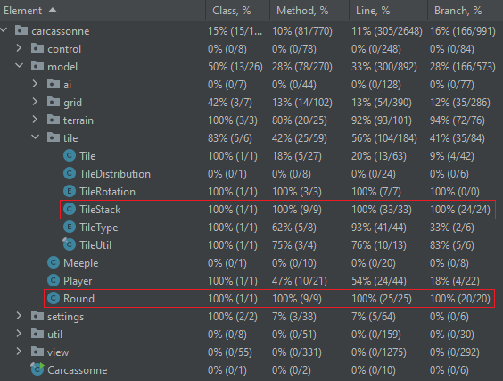

 
	

Contributor: Bart Hogenes

I used this project to apply the methodologies I learned from ["Pragmatic Unit Testing in Java 8 with JUnit"](https://pragprog.com/titles/utj2/pragmatic-unit-testing-in-java-8-with-junit).  
I wrote tests for two classes `TileStack` and `Round` so that they have 100% coverage on method, line and branch level:

  
Screenshot

  Run all with coverage result

To reduce code duplication in the tests as much as possible, I split them up according to their setup code.
The test methods are structured according to the triple-A pattern, and the acronyms `FIRST`, `RIGHT` en `CORRECT` are taken into account aswell.  
There is an `Invariant test` in the `tearDown` of the `EmptyTileDistributionTest`.  
The classes are also tested on any `forced errors` that I could find.

### About this project
This is a slightly adapted, digital version of the board game Carcassonne.  
Carcassonne is a tile-based board game in a medieval setting created by [Klaus-Jürgen Wrede](https://www.kjwrede.de/) and published by [Hans im Glück](https://www.hans-im-glueck.de/en/verlag.html).  
This project implements Carcassonne as an open-source platform-independent computer game that supports up to five players at the same time with shared-screen multiplayer mode. It stays true to Carcassonne's original look and gameplay while making some changes, such as new tiles and minor tweaks to the emblems. It currently contains the complete main game, some features from extensions, as well as some completely new functionalities. 
The official rules can be found here: [Part 1](https://images.zmangames.com/filer_public/d5/20/d5208d61-8583-478b-a06d-b49fc9cd7aaa/zm7810_carcassonne_rules.pdf), [Part 2](https://images.zmangames.com/filer_public/14/af/14af825c-9879-42b8-851d-35ce41df7767/carcassonne-supplement.pdf).

	

#### Requirements
- [Java SE 11](https://www.oracle.com/de/java/technologies/javase-downloads.html) or newer.

